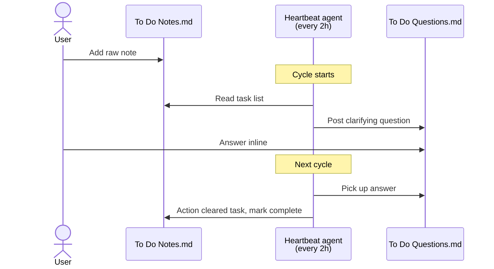

# Claude Workspace — Meta Architecture *(redacted)*

> **Scope:** how a personal `Claude` workspace is wired *for Claude*. Personas, routines, hooks, memory, and the coordination layer between them. **Not** the architecture of any individual project inside it — project application architecture lives alongside each project.
>
> **Audience:** anyone curious about how a practical Claude Code workspace is structured end-to-end.
>
> **Last updated:** 2026-04-20 — **OS-level Whisper dictation now the voice-input path across every Claude surface (desktop + phone + Remote Control); planned voice-channel rebuild retired.** Claude's built-in voice mode (terminal + desktop app) is closed to third-party STT/TTS swaps, so rebuilding a custom voice-channel server would only ever improve one surface. Instead the workspace now leans on an OS-level dictation layer at every surface. On desktop: a Whisper-based dictation tool (e.g. Wispr Flow) — hold a hotkey, speak, transcribed text is typed into whatever field has focus — covers the Claude Code CLI (including Remote Control terminal sessions launched via `remote-control.bat`), the Claude desktop app, Claude web, and any other text input on the machine. On phone: the same tool's native Android app, granted accessibility control, surfaces a dictation icon whenever a text box is tapped — including inside the Claude Android app's prompt field. Net effect: full voice-input coverage on every device the user talks to Claude from (home desktop, remote-controlled desktop session, phone), with zero integration code on the workspace side. The existing `voice-channel` MCP stays operational for its mobile file-upload role (photo drops for the nutrition tracker and receipts inbox); voice I/O on that server is deprioritised. The corresponding "Improved voice integration" entry in §14 Planned future upgrades has been removed. TTS of Claude's replies intentionally left unaddressed — revisit only if hands-free/eyes-free becomes a concrete pain point. Earlier today — **New `Reference/Research/` folder convention for preserved research briefs.** When a `researcher`-role investigation produces a defensible output worth keeping across sessions, it lands in `<workspace>/Reference/Research/` as `YYYY-MM-DD_<topic-slug>.md`. Each brief carries frontmatter (`type: research`, `status`, `last_verified`, `verify_by_checking`, `methodology`, `tags`), leads with answer-first synthesis, and preserves the subagent transcripts as appendices — Iron Law: "no brief without appendices." The folder sits alongside the services registry and email-rules registry as the workspace's "research outbox" (complement to the service inbox and automation rules). Earlier today — **New auto-routed workspace subagent wrapping the `researcher` role.** A workspace-level subagent at `<workspace>/.claude/agents/researcher.md` composes the canonical role via `@`-include; its CSO-style description is picked up by Claude Code's subagent picker so research-shaped tasks (market/competitor scans, technical library comparisons, regulatory/tax research, literature reviews, due diligence, fact-checking) auto-route to `researcher` rather than `general-purpose`. User-global `CLAUDE.md` § Subagent Strategy carries an explicit preference directive for reinforcement. Effective on next session — the `.claude/agents/` directory is scanned at session launch, not hot-reloaded. `requires_context: false` → no project binding required; entity facts are passed inline by the calling agent when needed. Earlier today — **New canonical role: `researcher`.** Evidence-based investigation role added to the library (v1.0.0, category `research`, default model `opus`, tools include `WebSearch`/`WebFetch`/`Agent` for multi-source triangulation). Blends three disciplines: consulting-analyst structure (answer-first, MECE, Pyramid Principle), investigative-journalism fabrication guards (two-source rule, claim-evidence-attribution, no composites), and academic systematic-review rigour (pre-committed inclusion criteria, dissent as data, graded evidence). Core constraints: primary-source preference (statute > commentary, paper > press, changelog > tutorial), compound-attribute verification against fabrication, two-axis Admiralty-style source grading (reliability × claim credibility), every claim tagged `[observed]`/`[inferred]`/`[unverified]`, load-bearing claims quote-then-paraphrase. Intentionally unbound (`requires_context: false`) — invoked directly, not through a project binding. Library count 16 → 17. Earlier — **Scheduled-task firing restored via OS-level scheduler.** A user report (the daily brief never landed in the user's inbox) revealed that the Claude Code app's built-in `scheduled-tasks` MCP was listed in `settings.json` permissions but never actually connected (verified via `claude mcp list` — the server did not appear). Consequence: SKILL.md files under `<home>/.claude/scheduled-tasks/` were not firing on their own. Fix: register OS-level Task Scheduler entries pointing at a thin wrapper (`scripts/run-scheduled-skill.ps1`) that reads the SKILL.md, pipes the content as the prompt to `claude --print --add-dir <workspace>`, and tees all output to a timestamped log in `<workspace>/tasks/scheduled-logs/`. The wrapper uses the Continue error-action preference per the PS 5.1 native-CLI lesson. Workaround until the built-in MCP is available or a future Claude release ships a canonical binding mechanism. Earlier — **Memory architecture hardening.** Split the always-loaded semantic memory from one-off episodic events via a new `episodes/` subfolder (one-off events — cleanups, migrations, launches — move there and are no longer referenced from the `MEMORY.md` index, keeping the always-loaded prefix small). Added `learned_on` / `last_verified` / `verify_by_checking` YAML frontmatter to all `reference_*.md` memory files so drift is surfaceable. New memory-lint script walks memory + episodes and verifies every referenced file path still exists; runtime-created paths (browser-profile dirs, MCP log folders, OAuth state dirs) allowlisted. New weekly `consolidate-memory` scheduled task does the deeper pass — resolves contradictions against source-of-truth docs, converts relative→absolute dates, merges duplicates, moves stale episodes, keeps `MEMORY.md` under its 200-line ceiling. Four-op discipline per fact (ADD / UPDATE / DELETE / NOOP). The heartbeat agent gained a "Memory lint" step in every cycle. User-global `CLAUDE.md` gained a `Memory hygiene` section codifying dedup-on-write, point-don't-mirror, four-op discipline, and Anthropic's verbatim memory-tool hygiene rule. The `wrap` skill now mirrors every `META_ARCHITECTURE` touch to the public redacted copy and pushes — a drift-prevention habit so the public snapshot never falls behind the private source. Earlier — Gmail Automation Stack shipped: new `morning-brief` scheduled task (daily) orchestrates email triage + receipt capture + bill tracking + appointment extraction + local weather brief. Five new Python helpers in `scripts/` (`email_rules.py`, `receipts_pipeline.py`, `bill_tracker.py`, `appointments.py`, `send_self_email.py`) consume an email-rules registry and a services registry. Brief shows appointments for next 14 days + task-list counts + open-questions digest. Delivery: SMTP self-send to the user's own inbox via `send_self_email.py`, with draft fallback. **Narrow Iron Law exception** (2026-04-19): `send_self_email.py` hardcodes recipient as the user's own address and refuses any other; MCP send-email remains ungranted; all other email operations still drafts-only. Earlier same day: inbox cleanup (~25k → 0) across 8 batches; created an email-rules registry (~500 rules, YAML schema, consumer-tagged for bill-monitor/receipt-capture/email-triage/morning-brief/tax-receipts). Earlier same day: added Google Calendar + Google Workspace MCP servers (Calendar full, Gmail readonly, Drive readonly); extended file protection to Google OAuth credentials. 2026-04-18 — extended the services registry into a subscription tracker (new `Next renewal` + `Tax` columns); added a renewals scan to the heartbeat loop. Earlier the same day: added a `developmental-reviser` role + project binding; reorganised a novel project into a new `Books/` group.

## Contents

1. [Layers at a glance](#1-layers-at-a-glance)
2. [Personas — the Roles Library](#2-personas--the-roles-library)
3. [Routines — recurring agents and one-shot launchers](#3-routines--recurring-agents-and-one-shot-launchers)
4. [Hooks — automatic behaviours on events](#4-hooks--automatic-behaviours-on-events)
5. [Skills — invokable capabilities](#5-skills--invokable-capabilities)
6. [Subagents — specialised workers](#6-subagents--specialised-workers)
7. [MCP servers — external capability bridges](#7-mcp-servers--external-capability-bridges)
8. [Memory system — persistent context across sessions](#8-memory-system--persistent-context-across-sessions)
9. [Task coordination layer](#9-task-coordination-layer)
10. [File protection / safety](#10-file-protection--safety)
11. [Project layout](#11-project-layout)
12. [Where things live (quick reference)](#12-where-things-live-quick-reference)
13. [Maintenance](#13-maintenance)
14. [Planned future upgrades](#14-planned-future-upgrades)

Companion docs: [ADOPTION.md](ADOPTION.md) — 5-step walkthrough for setting up a similar workspace · [samples/](samples/) — scaffold files illustrating each layer.

## Conventions

- **`<workspace>`** / **`<home>`** / **`<project>`** are placeholders; substitute your own paths.
- Type markers in tables:
  - **[stock]** — ships with Claude Code out of the box
  - **[plugin]** — installed via a plugin
  - **[local]** — local external install (npm global, uvx, standalone binary)
  - **[custom]** — written for this workspace

---

## 1. Layers at a glance

```mermaid
flowchart TB
    I["Input methods<br/>Keyboard · Whisper dictation — desktop (hotkey → text)<br/>· Whisper dictation — mobile (tap text box → dictation)"]
    E["User entry points<br/>Terminal · Remote Control terminal · Desktop app<br/>· Mobile app · Remote chat · Voice UI"]
    S["Claude session<br/>CLAUDE.md · Memory · Hooks"]
    P["Personas<br/>roles/ + project bindings<br/>(subagents composed with CONTEXT.md)"]
    R["Routines<br/>scheduled tasks + launcher scripts<br/>(heartbeat, audit, upgrade-audit)"]
    M["MCP servers<br/>voice · remote chat · scheduled-tasks ·<br/>directory · browser · preview · registry ·<br/>Calendar · Workspace"]
    I --> E
    E --> S
    S --> P
    S --> R
    S --> M
```



Input methods layer above entry points: text typed into any surface (terminal, Remote Control terminal, desktop app, mobile app, remote chat, voice UI) can come from a keyboard or from an OS-level Whisper dictation layer. The same dictation tool runs on both desktop (hotkey → text into focused field) and phone (tap any text box → dictation icon), so voice input is available everywhere the user talks to Claude without any workspace-side integration. Six surfaces sit above the Claude session (entry points), three sit below (personas, routines, MCP). Each section from §2 onward details one slice.

---

## 2. Personas — the Roles Library

> See also: [Claude Code subagents documentation](https://docs.claude.com/en/docs/claude-code/sub-agents).

**Library:** `<workspace>/roles/` — 17 pure, reusable canonical role definitions, each with a fixed schema (frontmatter + Identity / Directives / Constraints / Method / Output format / Red Flags / Rationalization Table).

**Canonical roles (17):** `accountant`, `backend-developer`, `bookkeeper`, `data-engineer`, `developmental-editor`, `developmental-reviser`, `frontend-developer`, `health-data-analyst`, `learning-strategist`, `llm-engineer`, `nutritionist`, `platform-engineer`, `product-thinker`, `researcher`, `security-auditor`, `tester`, `wealth-manager`.

**Composition:** each project has thin subagent bindings under `.claude/agents/` that compose a canonical role with the project's `CONTEXT.md` (entity facts) via `@` includes.

**Rule:** roles are pure (no entity facts). Entity facts live in each project's `CONTEXT.md`.

```mermaid
flowchart LR
    role["Canonical role<br/>roles/security-auditor.md<br/>(pure, no entity facts)"]
    ctx["Project CONTEXT.md<br/>(entity facts: stack, paths, decisions)"]
    binding["Thin binding<br/>project/.claude/agents/<br/>project-security.md<br/>(role + CONTEXT via @ includes)"]
    call["@project-security<br/>invocable subagent"]
    role --> binding
    ctx --> binding
    binding --> call
```

**Validation:** a roles validator script checks frontmatter schema + binding composition. Runs every heartbeat cycle; exit non-zero surfaces a question.

| Project type | Bindings (illustrative) | Context source |
|---|---|---|
| Personal finance | accountant / wealth-manager / bookkeeper | project `CONTEXT.md` |
| Software product | backend / frontend / tester / security / llm / product | project `CONTEXT.md` |
| Personal health | health-analyst / nutritionist | project context file |
| Creative writing | developmental-editor / developmental-reviser | project `CONTEXT.md` |
| Education | learning-strategist | project `CONTEXT.md` |

**Not yet bound to any project:** `data-engineer`, `platform-engineer`, `researcher`. The `researcher` role is intentionally unbound — it's domain-agnostic (`requires_context: false`) and invoked directly for evidence-based investigation on any topic.

**See also:** a `roles/README.md` with the schema and binding quick-reference; a `roles/_template.md` for new roles. A filled-in example lives at [`samples/roles/security-auditor.md`](samples/roles/security-auditor.md) (one of 17 canonical roles shipped in `samples/roles/`).

---

## 3. Routines — recurring agents and one-shot launchers

### Entry points — Claude Code app

Previously the workspace was driven from a handful of terminal windows, each one launched by a `.bat` script and holding its own Claude session. The Claude Code desktop app now unifies that surface:

- **Routines** — the app's built-in scheduler — replace most launcher `.bat` files for recurring work. Terminal launchers are retained only for flows that need specific env-var hygiene or direct shell control.
- **Persistent parallel sessions** are the main win. The app holds many independent sessions open side-by-side, each anchored to a different workstream; the user actions whichever is ready. At the time of writing: 9 sessions cycled through earlier the same day, with ~50 agents and subagents running concurrently across them — each a different thread (bug fix, document edit, research query, project scaffold).

Net effect: less context-swap tax. Each thread stays warm; the user returns to it when it's useful rather than reconstructing state every time.

### Launcher scripts (`<workspace>/scripts/`)

All entries below are **[custom]**.

| Script | Purpose |
|---|---|
| `launch-claude.bat` | Bootstrap launcher with CLAUDE.md sanity check across all project folders. Primary entry point for terminal sessions. Delegates to `_bootstrap-check.bat`. |
| `_bootstrap-check.bat` | Shared subroutine. Scans project folders for missing CLAUDE.md files and offers to create stubs. Called by the other launchers. |
| `remote-control.bat` | Starts a Claude session with Remote Control enabled. Bootstrap check + interactive session. Must be double-clicked — cannot be invoked from within Claude Code (env inheritance issue). |
| `voice-channel.bat` | Kills any stale process on the voice port, then launches the voice-channel MCP server. |
| `shopping-chrome.bat` | Launches Chrome with remote debugging port and a dedicated profile. Persists store logins across automation sessions. Used by a personal shopping-agent project. |
| `check-usage.bat` | Opens the Claude usage dashboard and runs a usage-stats CLI to show current 5-hour window burn rate. |
| `audit.bat` | Runs the audit agent — reviews configs, hooks, CLAUDE.md quality, test coverage, security; writes recommendations to the task list. |
| `backup-restic.ps1` (+ `.bat` launcher) | Manual encrypted backup of the workspace to an S3-compatible object-storage target via `restic`. Client-side encryption — provider only ever sees ciphertext. Repo password + storage credentials pulled from the password-manager CLI at runtime (no secrets in the script or any synced file). Dedup + incremental + granular file-level restore. Retention: 7 daily + 4 weekly + 6 monthly. |
| `restic-verify.ps1` (+ `.bat` launcher) | One-shot verification: lists snapshots, runs a read-data integrity check, performs a file-level restore round-trip and SHA256-diffs against source. Use before relying on the backup for recovery. |
| `backup-excludes.txt` | Exclude patterns for the backup (`.venv`, `node_modules`, `__pycache__`, etc.). |
| `email_rules.py` | **Gmail Automation Stack — Phase 1.** YAML parser + validator + matcher for the email-rules registry (~500 rules across 5 consumer tags: `bill-monitor`, `receipt-capture`, `email-triage`, `morning-brief`, `tax-receipts`). Handles `extends` inheritance, `senders: [...]` list expansion, split `action: {future:…, historical:…}`. Most-specific-wins matching. CLI: `validate`, `stats`, `index`, `match`, `match-batch`, `draft-rule`. |
| `receipts_pipeline.py` | **Gmail Automation Stack — Phase 2.** Receipt ingestion: schema validation, categorisation, dedup against existing ledger rows, append + save, optional source-file filing. Supports both email-extracted and photo-OCR extracted receipts. |
| `bill_tracker.py` | **Gmail Automation Stack — Phase 3.** Parses the services registry into typed `Service` rows with cost normalised to monthly. Matches incoming bills to services by hint/sender/domain. Appends to an actuals log. Four alert triggers: >20% over-threshold / unknown sender / cancelled-service renewal / duplicate. |
| `appointments.py` | **Gmail Automation Stack — Phase 5.** Validates extracted appointment payloads, formats for the Calendar MCP `create-event`, generates dedup token embedded in event description. |
| `send_self_email.py` | **Narrow Iron Law exception (2026-04-19).** The *only* path by which Claude sends email autonomously. Hardcodes recipient as the user's own address and raises a `SelfOnlyViolation` on any other address. Uses SMTP (not MCP) with an app password resolved from env var or OS keychain. Intended solely for morning-brief delivery; all other email operations still go through MCP drafts. |

### Scheduled tasks (`<home>/.claude/scheduled-tasks/`)

The scheduler itself is **[stock]** (either the Claude Code app's Routines UI or the `scheduled-tasks` MCP). The specific tasks below are **[custom]**.

| Task | Cadence | Purpose |
|---|---|---|
| `heartbeat-monitor` | Every 2 hours | Reads task queue, posts clarifying questions, actions cleared tasks, flags stale items. Runs stale-CONTEXT.md scan, stale-PLAN.md scan, roles validator, and upcoming-renewals scan every cycle. **Anti-duplication guard:** before actioning any task, checks project folder state (`PLAN.md` checklist, `git log`, recent file activity, staging folders). If ANY evidence of prior work exists, posts a progress-check question and waits rather than re-scaffolding. |
| `morning-brief` | Daily (early morning) | Gmail automation orchestrator added 2026-04-19. Runs four pipelines: (1) email triage — applies Gmail actions (label/archive/trash), drafts new-sender proposals; (2) receipt capture — email path + photo path via a drop folder; appends to a ledger workbook; (3) bill & subscription tracker — matches bills against the services registry, logs to an actuals workbook, emits four alert triggers; (4) compose + deliver brief — appointments next 14 days via Calendar MCP + local weather + active task counts + open questions + overnight activity, written to a dated markdown file + sent self-to-self via the narrow-exception SMTP helper with a draft fallback. Appointment extraction runs between (3) and (4). Idempotent. |
| `upgrade-audit` | Weekly | Runs the full audit agent — Phase 1 global setup, Phase 2 per-project, Phase 2.5a plugin/MCP bloat check, Phase 2.5b external opportunities (web research), Phase 2.6 security review, Phase 3 write recommendations. Writes to the task list under `## Setup Review` and `## Security` sections. |
| `consolidate-memory` | Weekly | Memory hygiene pass — runs the memory-lint script with `--fix`, resolves contradictions between memory files and source-of-truth docs, converts relative→absolute dates, merges duplicates, moves stale episodes to the `episodes/` subfolder, keeps `MEMORY.md` under its 200-line ceiling. Four-op per fact (ADD / UPDATE / DELETE / NOOP). Iron Laws in memory are never consolidated away. |
| `check-usage` | Manual | Opens usage dashboard and runs usage stats. |
| `remote-control` | Manual (disabled) | Disabled — cannot launch from Claude Code due to env inheritance. Use `remote-control.bat` directly. |

> **Note on remote triggers:** Remote triggers run in Anthropic's cloud sandbox and cannot access local workspace files, so they could not do heartbeat/audit jobs that need to read or write locally. Local scheduled-tasks are the canonical path for any routine that needs to touch local files.

### Automated infrastructure (OS-level scheduler)

On systems where the Claude Code app's built-in `scheduled-tasks` MCP is **not connected** (listed in `settings.json` permissions allowlist but absent from `claude mcp list`), SKILL.md files under `<home>/.claude/scheduled-tasks/<name>/` will never fire on their own. The durable workaround is OS-level scheduling — Windows Task Scheduler (shown below) or `cron`/launchd on Linux/macOS — pointing at a thin wrapper that reads the SKILL.md and pipes it to `claude --print`.

| Task | Cadence | What it does |
|---|---|---|
| Morning Brief | Daily, early morning | Invokes the wrapper with `-Skill morning-brief` |
| Consolidate Memory | Weekly | Invokes the wrapper with `-Skill consolidate-memory` |

**Wrapper — `<workspace>/scripts/run-scheduled-skill.ps1`:** reads `<home>/.claude/scheduled-tasks/<Skill>/SKILL.md`, pipes the content as the prompt to `claude --print --add-dir <workspace>`, tees output to `<workspace>/tasks/scheduled-logs/<Skill>_<YYYY-MM-DD-HHMM>.log`. `-DryRun` resolves paths without invoking. Uses the Continue error-action preference per the PowerShell 5.1 native-CLI lesson (PS 5.1 otherwise promotes native-command stderr writes to terminating exceptions).

The previous dedicated nightly backup job was removed in favour of manual-only invocation via the restic script.

> **Note:** Remote Control cannot be launched from within Claude Code. Child processes inherit OAuth env vars that force API mode and break MCP server connections. Use the `remote-control.bat` launcher via double-click or desktop shortcut only.

---

## 4. Hooks — automatic behaviours on events

> See also: [Claude Code hooks documentation](https://docs.claude.com/en/docs/claude-code/hooks). A sample hook config lives at [`samples/.claude/settings.example.json`](samples/.claude/settings.example.json).

The **mechanism** is **[stock]**; each hook's **command** is **[custom]**. Configured globally in `<home>/.claude/settings.json`.

| Hook | Trigger | Effect |
|---|---|---|
| **PreToolUse** | Before `Edit` or `Write` | Blocks modification of protected files: `.env*`, `credentials*`, `secrets*`, lock files, a few specific sensitive project files, financial result workbooks, bank transaction CSVs, Google OAuth tokens. Path match is case-insensitive. |
| **PostToolUse** | After `Edit` or `Write` | Auto-formats `.py` with `ruff format` + `ruff check --fix`; auto-formats `.ts/.tsx/.js/.jsx/.mjs/.cjs` with `prettier --write` (if prettier on PATH). |
| **SessionStart** | After context compaction | A short prompt re-injects context: read the lessons file, check active task list, load path-scoped rules, remember the meta-architecture for structural questions. |
| **Notification** | On tool result | OS notification (async, brief timeout). |

---

## 5. Skills — invokable capabilities

> See also: [Claude Code skills documentation](https://docs.claude.com/en/docs/claude-code/skills). A sample custom skill lives at [`samples/.claude/skills/orient/SKILL.md`](samples/.claude/skills/orient/SKILL.md).

### Custom workspace skills (`<workspace>/.claude/skills/`)

All entries below are **[custom]**.

| Skill | Purpose |
|---|---|
| `orient` | Session-start briefing. Reads the meta-architecture, CLAUDE.md, the task set, and freshness-checks project CONTEXT.md / PLAN.md files. Returns active state, in-flight work, open questions, staleness flags, and a recommended next action. |
| `wrap` | Task close-out ritual. Updates the implementation plan review section, strikes through the matching task-list bullet, resolves linked questions, sweeps registries (command shortcuts, skill/subagent/scheduled-task/launcher/MCP/hook tables, project layout, file protection, memory index, project context, services registry). |
| `tasks` | Task-queue readout. Parses the task list (active bullets, grouped by section) and the questions file (open questions only). Read-only. Lighter than `orient`. |
| `verify-completion` | Mandatory self-review gate. Invoke before claiming any implementation task, bug fix, or test/build/lint pass is complete. |
| `systematic-debugging` | Structured approach to investigating bugs, errors, test failures, or unexpected behaviour when not immediately obvious. |
| `role-pressure-test` | Adversarial test one role against realistic pressure. Invoke when deploying a new role or significantly modifying an existing role's Constraints / Red Flags / Rationalization Table. |
| `grocery-run` | **(Stub)** Placeholder for upcoming shopping-agent workflow. |

### Anthropic + plugin skills

All entries below are **[stock]** or **[plugin]** (shipped by Anthropic or available as plugins). User-invocable via `/`. Typical set: `update-config`, `keybindings-help`, `simplify`, `less-permission-prompts`, `loop`, `schedule`, `claude-api`, `pdf`, `docx`, `pptx`, `xlsx`, `consolidate-memory`, `skill-creator`, `setup-cowork`, `init`, `review`, `security-review`.

---

## 6. Subagents — specialised workers

> See also: [Claude Code subagents documentation](https://docs.claude.com/en/docs/claude-code/sub-agents).

### Workspace custom subagents (`<workspace>/.claude/agents/`)

All entries below are **[custom]**.

| Agent | Role |
|---|---|
| `audit` | Setup / project / security audit. Read-only except for the task list. Canonical instructions drive both `audit.bat` and the weekly audit scheduled task. |
| `heartbeat` | Project manager. Runs every 2 hours. Reads/writes task files. Manages the question-then-action loop + anti-duplication guard. |
| `researcher` | Evidence-based research with fabrication guards and source discipline. **Auto-routed** — when any agent spawns a subagent for a research-shaped task, Claude Code's subagent picker prefers this over `general-purpose` based on the description field. Composes the canonical `researcher` role via `@`-include (one source of truth). `requires_context: false` — no project binding needed; calling agent passes entity facts inline if required. Read-only + web tools + fan-out. |

### Project role bindings (per project, see §2)

Each project directory keeps its own `.claude/agents/` folder with project-scoped bindings — all **[custom]**.

### Built-in subagent types

All **[stock]**: `general-purpose`, `Explore` (codebase search), `Plan` (architecture/planning), `claude-code-guide`, `statusline-setup`, plus the two workspace-custom ones above.

---

## 7. MCP servers — external capability bridges

> See also: [Claude Code MCP documentation](https://docs.claude.com/en/docs/claude-code/mcp).

| Server | Type | Purpose |
|---|---|---|
| `voice-channel` | Local stdio (Bun) | **[custom]** Browser-based voice/text web UI for Claude Code. Self-signed HTTPS on LAN. |
| Remote chat channel | Plugin | **[plugin]** Task dispatch from a chat client. |
| `scheduled-tasks` | Built-in | **[stock]** Create/list/update scheduled tasks. |
| Directory access | Built-in | **[stock]** Request access to host directories outside CWD. |
| Browser automation | Built-in | **[stock]** Tabs, screenshots, DOM, network. |
| Preview server | Built-in | **[stock]** For dev work (start/stop, console, network, screenshots). |
| Registry search | Built-in | **[stock]** Search and suggest connectors from the MCP registry. |
| GitHub | Plugin | **[plugin]** Native GitHub issue/PR/CI tools. |
| TypeScript LSP | Plugin | **[plugin]** Diagnostics, go-to-definition, find-references after edits. |
| Context7 | Plugin | **[plugin]** Real-time, version-specific documentation from source repos. |
| Google Calendar | Local stdio (npm global) | **[local]** Google Calendar read+write. OAuth creds + tokens in a protected local folder. Workspace-scoped. |
| Google Workspace | Local stdio (uvx) | **[local]** Gmail + Drive read-only. Shares the same OAuth client as the Calendar server. Workspace-scoped. |

---

## 8. Memory system — persistent context across sessions

> See also: [Claude Code memory documentation](https://docs.claude.com/en/docs/claude-code/memory).

**Location:** `<home>/.claude/projects/<workspace-id>/memory/`

**Index:** `MEMORY.md` — always loaded, ~150 chars per entry, **capped at 200 lines / 25 KB** (matches the Claude Code auto-memory ceiling).

**Subfolder:** `episodes/` — one-off events (cleanups, migrations, launches). NOT referenced from `MEMORY.md`, NOT always loaded; browsed on demand when historical context is needed. Separating episodic from semantic content keeps the always-loaded prefix small and stops date-stamped "we did X" narratives silently masquerading as durable facts.

**Types:**
- **user** — profile, role, goals, preferences. Tailors how Claude communicates.
- **feedback** — corrections and validated approaches. Prevents repeated mistakes.
- **project** — durable state, Iron Laws, pointers at source-of-truth docs (`CONTEXT.md`, `PLAN.md`, registries). Prefer pointing over mirroring — the canonical source changes faster than memory, and a copy rots.
- **reference** — pointers to external systems and to internal architecture (this file, the roles library). Carry `learned_on` / `last_verified` / `verify_by_checking` YAML frontmatter so drift is surfaceable.

### Discipline (workspace-specific rules supplementing the system-prompt auto-memory policy)

- **Dedup on write.** Before creating a new file or appending a fact, grep existing memories — if information overlaps >60%, UPDATE the existing file, don't duplicate.
- **Point, don't mirror.** If the fact has a canonical home, memory keeps a short pointer, not a copy.
- **Four-op per fact:** ADD / UPDATE / DELETE / NOOP. Contradictions resolve to one verb, never both.
- **Verify before asserting from memory.** Memory is a point-in-time snapshot, not live state. A claim that names a file, flag, or service must be verified against the current repo before acting on it.
- **Anthropic's memory-tool system prompt, verbatim:** *"keep its content up-to-date, coherent and organized. You can rename or delete files that are no longer relevant. Do not create new files unless necessary."*

### Tooling

- **Memory-lint script** (`<workspace>/scripts/memory_lint.py`) — walks the memory directory and `episodes/`, checks every referenced file path exists. `--fix` refreshes `last_verified` on clean pass. `--notes` appends drift to the task list under a dated `## Memory — drift detected <date>` section, idempotent per-line. Runtime-created paths (e.g. browser-profile directories, MCP log folders, OAuth state dirs) are allowlisted so they don't flag. The heartbeat agent invokes the lint in every cycle.
- **Weekly `consolidate-memory` scheduled task** — the deeper pass. Resolves contradictions between memory and source-of-truth docs, converts relative→absolute dates, merges duplicates, moves decayed episodes into the subfolder, keeps `MEMORY.md` under its ceiling. Iron Laws in memory are never consolidated away. Canonical instructions: `<home>/.claude/scheduled-tasks/consolidate-memory/SKILL.md`.

---

## 9. Task coordination layer

All in `<workspace>/tasks/`:

| File | Owner | Purpose |
|---|---|---|
| `HEARTBEAT.md` | static | Heartbeat agent's operational instructions (question format, execution rules, task categories). |
| `To Do Notes.md` | user-written | Master task list. Heartbeat reads, asks questions, marks complete. |
| `To Do Questions.md` | heartbeat | Q&A tracker. Heartbeat posts questions inline; user answers inline; heartbeat picks up answers next cycle. |
| `todo.md` | claude (per task) | Current implementation plan with checkable items. Review section appended on completion. |
| `lessons.md` | claude (after corrections) | Self-improvement loop. Rules to prevent repeated mistakes. Loaded at session start. |

**Workflow:** user adds raw note to the task list → heartbeat posts clarifying questions → user answers inline → heartbeat actions the cleared task on next cycle.



A worked example of the task layer lives in [`samples/tasks/`](samples/tasks/).

### Command Shortcuts

A verbal-shortcut table in the workspace CLAUDE.md maps common user phrases to exact destination files so the agent doesn't have to guess as the folder structure grows. Covers things like "add to tasks", "add to food", "add to pantry", "book me…", "expense this", etc.

Rules:
- When a user phrase matches the table, go directly to the target — no clarifying question.
- A new shortcut emerges? Agent asks once, then adds it to the table so the shortcut works next time.
- Genuine ambiguity between two targets → ask rather than guess.

---

## 10. File protection / safety

**Hook-blocked patterns** (PreToolUse, blocks `Edit`/`Write`, case-insensitive path match):
- `.env*` — environment variables and secrets
- `credentials*`, `secrets*` — API keys
- Lock files (language dependency locks)
- A small number of agent-core files (heartbeat operational doc, a personal-health profile)
- Google OAuth client + token files
- Financial result workbooks
- Bank transaction CSV records

**Encrypted backup:** S3-compatible object storage via `restic` — client-side encryption, provider only ever sees ciphertext. Repo password + storage credentials retrieved from the password-manager CLI at runtime (no plaintext secrets in any script or synced file). Dedup + incremental + granular file-level restore. Retention: 7 daily + 4 weekly + 6 monthly.

### Credential store — password manager (canonical)

A commercial password manager is the authoritative store for every credential touched by this workspace. No plaintext credentials live in files, ever — not in `.env` (those are machine-local runtime configs and hook-protected), not in scripts, not in CLAUDE.md, not in CONTEXT.md, not in this file.

**Vault structure:** folders mirror the services-registry categories (personal and project-scoped).

**Master password + account recovery code:** stored offline in a physically secured location, separate from any digital copy. Recovery code regenerated annually or on suspected exposure.

**Index:** the services registry is the plaintext index — every service entry points at a password-manager item by name. When an agent needs a credential, it surfaces the item name; the user retrieves it manually.

**Audit integration:** the weekly audit scans the services registry and flags missing 2FA, stale rotations (>12 months), unresolved placeholders, and new `.env` keys not recorded in the registry.

---

## 11. Project layout

The workspace hosts a handful of parallel projects (a software product, a set of personal-admin folders, health records, a creative-writing project, a few ongoing personal-assistant experiments). Each is kept in its own folder with its own `CLAUDE.md`, `CONTEXT.md`, and — where relevant — a `PLAN.md`. Only a subset have role bindings today; the rest run on the main thread or generic subagents until their workflows stabilise.

Supporting folders:
- `roles/` — canonical persona library
- `scripts/` — launcher `.bat` files + backup PowerShell + the Gmail Automation Stack helpers
- `tasks/` — task coordination layer + one-off implementation plans
- `Reference/` — reference material (services registry, email-rules registry, shared docs)

---

## 12. Where things live (quick reference)

| Thing | Path |
|---|---|
| Workspace meta-architecture (this file, in the source workspace) | `<workspace>/META_ARCHITECTURE.md` |
| Workspace working context | `<workspace>/CLAUDE.md` |
| Global working context | `<home>/.claude/CLAUDE.md` |
| Roles library | `<workspace>/roles/` |
| Project role bindings | `<project>/.claude/agents/` |
| Project entity context | `<project>/CONTEXT.md` |
| Project plans | `<project>/PLAN.md` (for multi-phase projects) |
| Launchers + bootstrap + backup | `<workspace>/scripts/` |
| Scheduled tasks | `<home>/.claude/scheduled-tasks/` |
| Global hooks + settings | `<home>/.claude/settings.json` |
| Workspace permissions (local) | `<workspace>/.claude/settings.local.json` |
| Workspace custom agents | `<workspace>/.claude/agents/` (audit, heartbeat) |
| Workspace custom skills | `<workspace>/.claude/skills/` |
| Workspace path-scoped rules | `<workspace>/.claude/rules/` |
| Memory | `<home>/.claude/projects/<workspace-id>/memory/` |
| Memory episodes (one-off events) | `<home>/.claude/projects/<workspace-id>/memory/episodes/` |
| Memory lint script | `<workspace>/scripts/memory_lint.py` |
| Memory consolidation task | `<home>/.claude/scheduled-tasks/consolidate-memory/SKILL.md` |
| Scheduled-task wrapper (OS scheduler → SKILL.md) | `<workspace>/scripts/run-scheduled-skill.ps1` |
| Scheduled-task run logs | `<workspace>/tasks/scheduled-logs/<skill>_<YYYY-MM-DD-HHMM>.log` |
| Task coordination | `<workspace>/tasks/` |
| Google OAuth creds + tokens (hook-protected) | `<home>/.claude/google-auth/` |
| Encrypted backup | S3-compatible object storage, via `restic`; credentials pulled from the password-manager CLI |
| Services registry | `<workspace>/Reference/services-registry.md` |
| Email rules registry | `<workspace>/Reference/email-rules.md` |
| Research briefs (preserved `researcher`-role outputs with source grades + appendices) | `<workspace>/Reference/Research/` (README + `YYYY-MM-DD_<topic>.md` files) |
| Credentials | password-manager vault (NOT in any file) |

---

## 13. Maintenance

This file is the source of truth for the *meta* shape of the workspace. Update it when:

- A new persona/role is added or removed
- A new project gets role bindings (or an existing one loses them)
- A new launcher script, scheduled task, hook, or MCP server is added
- The memory taxonomy changes
- A protected-file pattern is added to the safety hook
- A new top-level project folder is created

**Do not** put project-specific application architecture here — that belongs in the project's own architecture doc.

---

## 14. Planned future upgrades

Drawn from the live task list and implementation-plan file as of 2026-04-19. Items already shipped are not listed.

### AI / workspace upgrades

- **Bittorrent integration** — scope TBD (media server stack / public-domain ebook fetcher / general download manager)
- **Home integration** — scope TBD (Home Assistant or direct smart-home device integration; potential tie-in with health data — sleep-room temp, morning light)
- **Job scanner** — scope TBD (career scanner across major boards, grants/RFP scanner, or similar)
- **Subagent-driven-development + dispatching-parallel-agents skills** — install from an open-source "superpowers" skill pack to codify a subagent-first philosophy
- **`PreCompact` hook** — add to selected project settings to prevent loss of in-flight state during long tasks
- **1-hour prompt-cache TTL env var** — set in launcher scripts for 1-hour cache TTL vs default 5-min (materially cuts token spend)

### Containerisation — sandbox for external-facing agents

Any agent that interacts with the open web — browser automation, web scraping, telephony integrations, retailer checkouts — is being moved behind a container boundary. The goal is security isolation of risky operations, **not** reproducibility; interactive Claude Code dev sessions continue to run on the host unchanged.

**Pattern:**
- Shared `agent-sandbox` base image (browser + agent runtime + minimal tooling), with per-project `docker-compose.yml` layered on top.
- Agent and the browser it drives are co-located in the same container so automated traffic stays internal.
- Credentials passed in at runtime via the password-manager CLI; never baked into the image.
- Per-project persisted browser profile — store logins survive between runs, and the agent looks like a real user rather than a headless bot (sidesteps most storefront bot-detection).

**Blast radius:** the container cannot see `.env` files, the personal finance folder, the credential-manager state, or any unrelated project directories. Only what the compose file explicitly mounts is reachable from inside.

**Rollout:**
- The shopping agent is the pilot — its `PLAN.md` already includes a "Phase 1b — container isolation" block.
- The appointments agent and reselling pipeline inherit the same pattern when their next phases activate.
- Status: plan drafted, Docker installable on host, not yet implemented.

### Personal projects (scaffolded, awaiting build-out)

- **Shopping agent** — Phase 1b: container isolation (sandbox for browser automation); Phase 2-4: add additional retailers + pantry awareness (agent proactively suggests based on household consumption). Currently blocked on a prepaid-card setup by the user.
- **Appointments agent** — Phase 1: online booking via browser automation (now unblocked by Google Calendar); Phase 2: phone calling via a hosted voice clone + telephony provider; Phase 3: proactive scheduling (agent books recurring checkups)
- **Reselling pipeline** — Phase 2: agent-executed listing and payment acceptance; Phase 3: sales analytics + listing optimisation

### Health

- **Fitness log** — structure decision pending (spreadsheet mirroring existing nutrition tracker / smartwatch sync / voice-channel freeform log)
- **Health-device rollout** — BP monitor → smartwatch → smart scale → CGM, staggered

### Structural / quality

- **Python unit tests for admin scripts** — cover categorisation + workbook update + extract scripts for regression protection on financial data
- **Path-scoped rules for the personal-finance folder** — bank-code conventions, FY conventions, xlsx write guards
- **Extend PreToolUse hook to cover more health data** — pathology, medication, immunisations folders; tracking workbooks

---

*Last verified against the repo structure on **2026-04-20**. Flag drift via an Issue or correct in a PR.*
